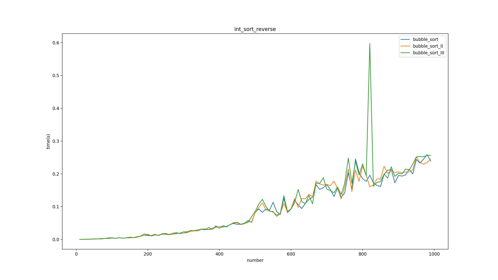

# 数据结构预算法之冒泡排序及其改进
[toc]

## 1. 冒泡排序
### 1.1 简介
&emsp;&emsp;冒泡排序可能是最简单粗暴的排序算法。冒泡排序不断遍历整个数组比较相邻的两个元素的大小是否符合最终要求的顺序，如果不符合则交换两个元素的位置，一直向后遍历，知道遍历完数组，这个过程就像泡泡浮出水面一样，所以被称为冒泡排序。
&emsp;&emsp;算法伪代码：
```
function bubble_sort(array):
    len = array.length
    for i from 0 to len - 1:
        for j from 0 to len - i - 1:
            if array[j] > array[j + 1]
                swap(array[j], array[j + 1])
```
### 1.2 流程可视化
#### 1.2.1 详细流程


#### 1.2.2 流程全貌


### 1.3 python实现
&emsp;&emsp;python实现代码：
```python
def bubble_sort(l, start, end):
    '''
    @brief  冒泡排序算法，排序区间[start, end]
    @param  l   需要进行排序的list
    @param  start   开始位置
    @param  end 结束位置
    '''
    count = 0
    for i in range(start, end + 1):
        for j in range(start, end - i):
            if l[j] > l[j + 1]:
                l[j + 1], l[j] = l[j], l[j + 1
```

## 2. 改进版II
### 2.1 改进思路
&emsp;&esmp;冒泡排序无论是最好最坏情况下都需要进行$\frac{n(n-1)}{2}$，需要一个在数组有序时终止算法的方式。我们可以知道当处于最坏情况下时，虽然还是会进行比较元素，但是不会执行交换元素，可以利用这一点设置一个标志位来判断后续的元素是否有序。

### 2.2 python实现
```python
def bubble_sort_II(l, start, end):
    '''
    @brief  冒泡排序算法，排序区间[start, end]
    @param  l   需要进行排序的list
    @param  start   开始位置
    @param  end 结束位置
    @note   使用sorted标志位记录后续的位置是否已经排序，按照冒泡排序算法的思路如果已经后面的位置未经过交换元素，后面一定已经有序
    '''
    count = 0
    sorted = False
    for i in range(start, end + 1):
        sorted=True
        for j in range(start, end - i):
            if l[j] > l[j + 1]:
                l[j + 1], l[j] = l[j], l[j + 1]
                sorted = False
                
        if sorted:
            break
```
## 3. 改进版III
### 3.1 改进思路
&emsp;&emsp;冒泡排序的第二个版本依然很大的减少了所需要比较的次数，但是每一次遍历中只要有一次交换就会付出本不应的代价。想象一个只有少量元素无序，大量元素无序的数组，很可能出现后面的元素已经有序，而前面的元素交换导致sorted被设置而无法界定实际的有序边界付出过多无用的成本。因此可以引入中间变量记录上次最后交换的索引，下次搜索直接将上一次交换的最后位置作为结束点。
### 3.2 python代码实现
```python
def bubble_sort_III(l, start, end):
    '''
    @brief  冒泡排序算法，排序区间[start, end]
    @param  l   需要进行排序的list
    @param  start   开始位置
    @param  end 结束位置
    @note   使用sorted标志位记录后续的位置是否已经排序，按照冒泡排序算法的思路如果已经后面的位置未经过交换元素，后面一定已经有序
    '''
    count = 0
    sorted = False
    sorted_border = end
    last_swap_index = 0
    for i in range(start, end + 1):
        sorted=True
        for j in range(start, sorted_border):
            if l[j] > l[j + 1]:
                l[j + 1], l[j] = l[j], l[j + 1]
                sorted = False
                last_swap_index = j
                
        sorted_border = last_swap_index
        if sorted:
            break
```
## 4. 性能对比
|数据分布|性能对比|
|:-:|:-:|
|无序||
|有序||
|逆序||
|90%有序||
|高斯分布||
|泊松分布||
|所有元素相同||
|数组中只有两个值||

## 5. 复杂度分析
|算法|时间复杂度|空间复杂度|最坏比较次数|最佳比较次数|
:-:|:-:|:-:|:-:|:-:|
|冒泡算法I|$O(n^2)$|$O(1)$|$O(\frac{n(n-1)}{2})$|$\frac{n(n-1)}{2}$|
|冒泡算法II|$O(n^2)$|$O(1)$|$O(\frac{n(n-1)}{2})$|$n$|
|冒泡算法III|$O(n^2)$|$O(1)$|$O(\frac{n(n-1)}{2})$|$n$|