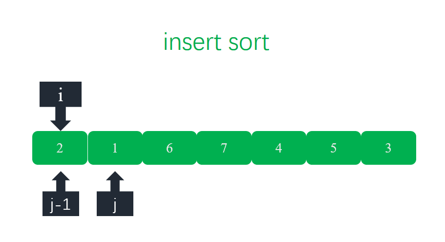
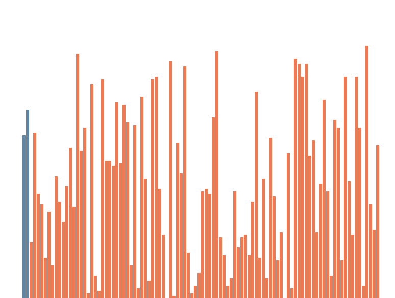
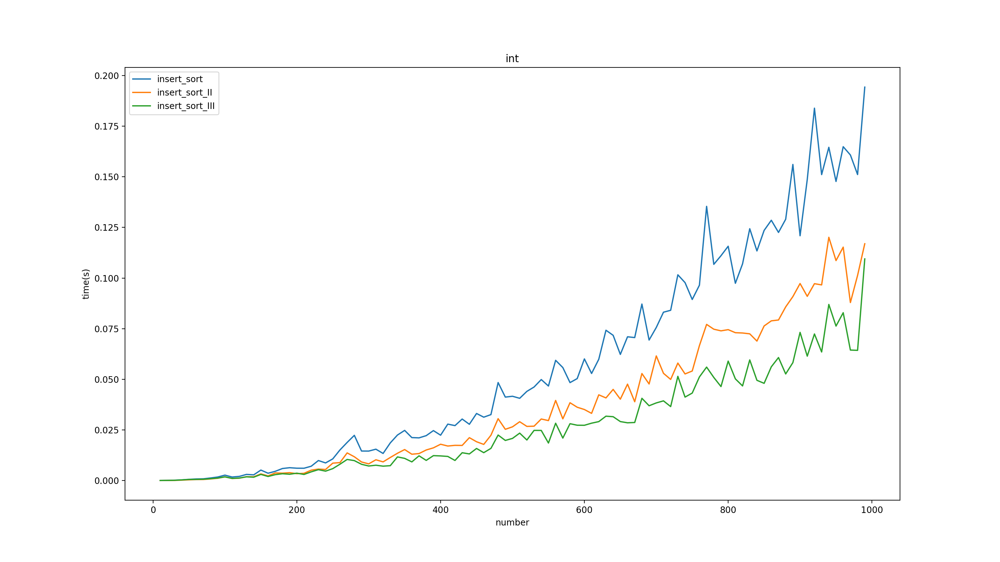
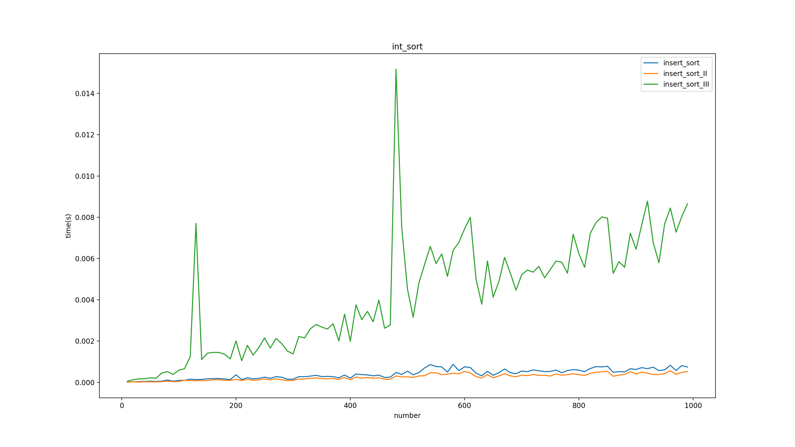
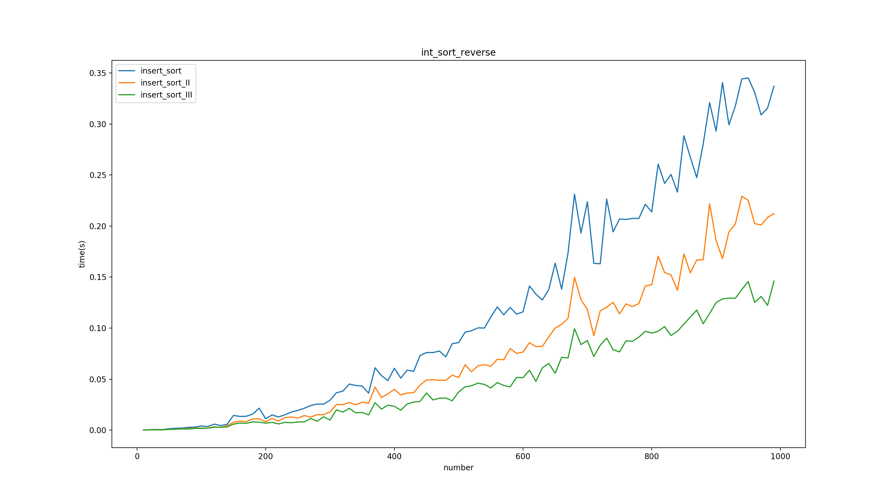
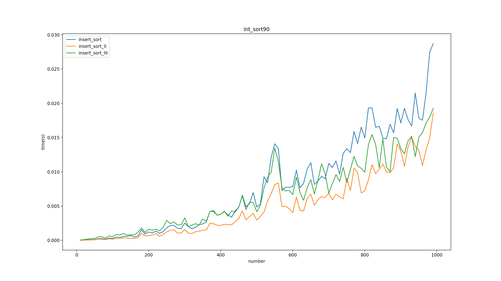
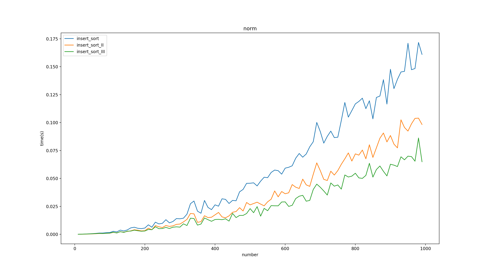
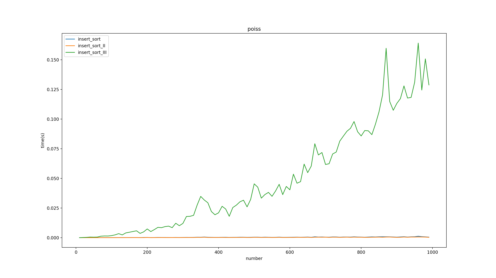
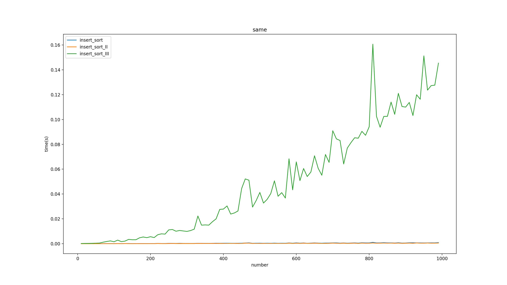
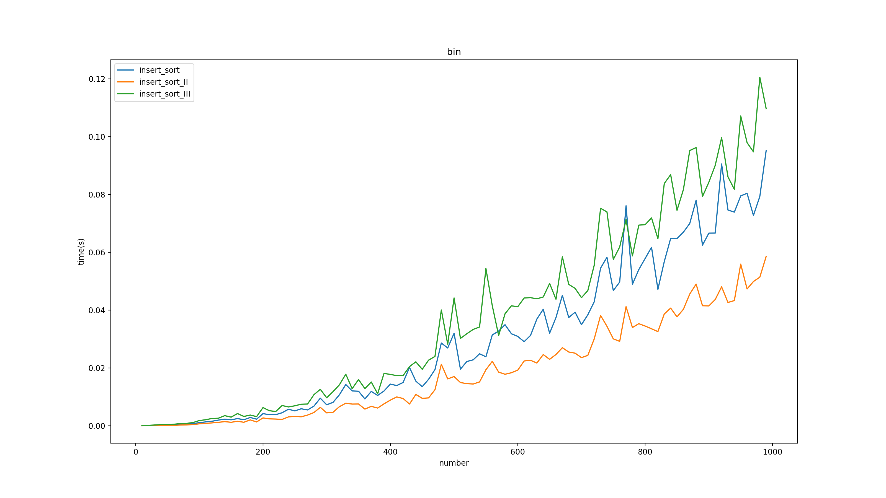

# 数据结构与算法之直接插入排序及其改进(可视化)
[toc]

## 1. 插入排序
### 1.1 简介
&emsp;&emsp;插入排序的基本思路是每一次遍历的时候将当前元素插入到之前已经有序的子数组中。
&emsp;&emsp;插入排序伪代码：
```
function insert_sort(list):
    for i from 1 to list.length - 1:
        j = i
        while list[i - 1] > list[i] && j > 0:
            swap(list[i - 1], list[i]) 
```
### 1.2 python代码实现
```python
def insert_sort(l, start, end):
    '''
    @brief  插入排序，排序范围[start, end]
    @param  l   进行排序的list
    @param  start   开始位置
    @param  end 结束位置
    '''
    count = 0
    for i in range(start, end + 1):
        j = min(end, i + 1)
        while j > start and l[j - 1] > l[j]:
            l[j], l[j - 1] = l[j - 1], l[j]
            j -= 1
```
### 1.3 流程


### 1.4 可视化


## 2. 插入排序改进II
### 2.1 思路
&emsp;&emsp;直接插入排序需要不断的交换两个元素可以引入一个哨兵，每次交换只写一次数组提升性能。具体操作是在每次遍历前记录下当前位置的元素值，遍历结束后放置到目标位置。

### 2.2 python代码实现
```python
def insert_sort_II(l, start, end):
    '''
    @brief  插入排序，排序范围[start, end]，排序时使用哨兵，减少对数组的访问
    @param  l   进行排序的list
    @param  start   开始位置
    @param  end 结束位置
    '''
    for i in range(start + 1, end + 1):
        tmp = l[i]
        j = i - 1
        while j >= start and l[j] > tmp:
            l[j + 1] = l[j]
            j -= 1
            
        l[j + 1] = tmp
```
## 3 插入排序改进III
### 2.1 思路
&emsp;&emsp;插入排序是向已经有序的子数组中插入当前值，既然是向有序数组中插入完全可以使用二分查找法查找目标插入区域，然后将目标值交换到具体位置。
### 3.2 python 代码实现
```python
def insert_sort_III(l, start, end):
    '''
    @brief  插入排序，排序范围[start, end]，排序时使用哨兵，减少对数组的访问
    @param  l   进行排序的list
    @param  start   开始位置
    @param  end 结束位置
    @note   使用二分查找法优化    
    '''
    for i in range(start + 1, end + 1):
        j = i
        left = start
        right = i
        while left <= right:
            mid = int(left + (right - left)/2)
            if l[mid] < l[j]:
                left = mid + 1
            else:
                right = mid - 1
        
        j = i
        value = l[j]
        while j > left:
            l[j] = l[j - 1]
            j -= 1
            
        l[j] = value
```

## 4. 性能对比
&emsp;&emsp;注：下面的图是用我的笔记本测试的不是很稳定，之后有时间用服务器测试下。
|数据分布|性能对比|
|:-:|:-:|
|无序||
|有序||
|逆序||
|90%有序||
|高斯分布||
|泊松分布||
|所有元素相同||
|数组中只有两个值||

## 5. 复杂度分析
|算法|时间复杂度|空间复杂度|最坏比较次数|最佳比较次数|
:-:|:-:|:-:|:-:|:-:|
|直接插入排序算法I|$O(n^2)$|$O(1)$|$\frac{n(n-1)}{2}$|$n-1$|
|插入排序算法II|$O(n^2)$|$O(1)$|$\frac{n(n-1)}{2}$|$n-1$|
|插入排序算法III|$O(n^2)$|$O(1)$|$nlog{n}$|$n-1$|
