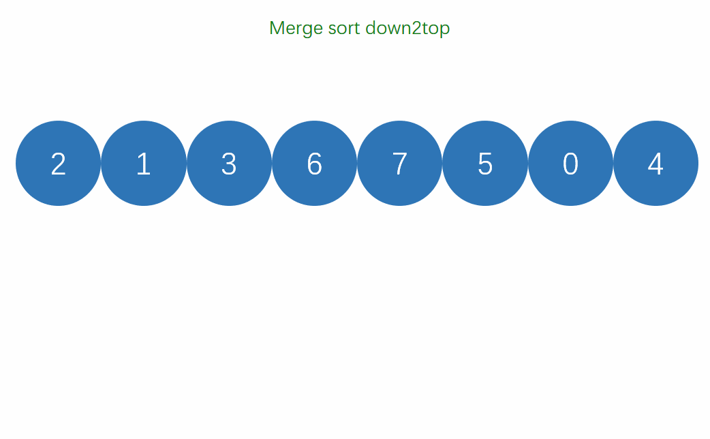
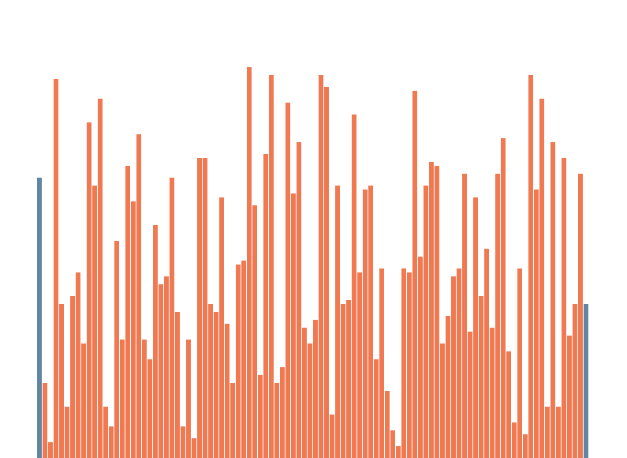
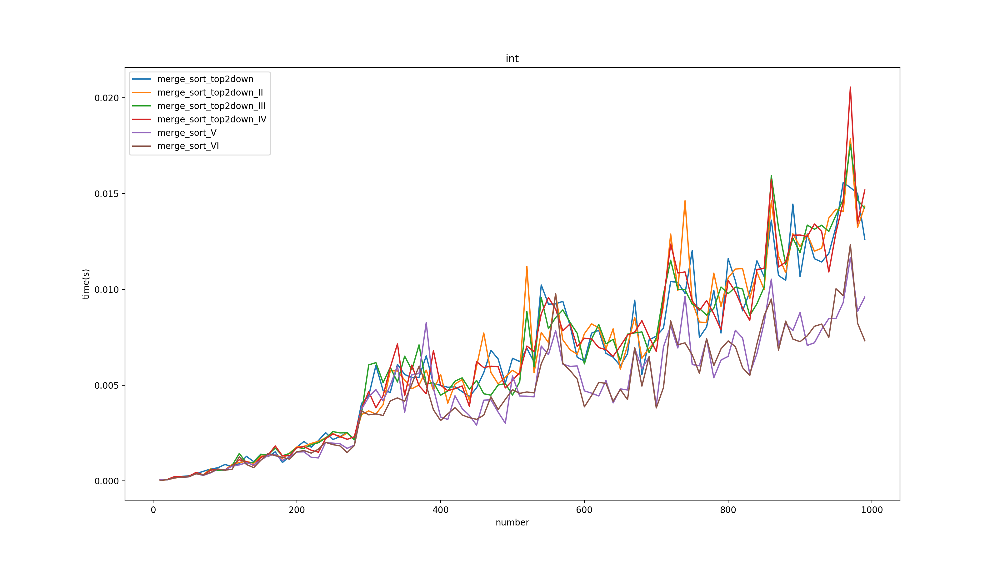

# 数据结构与算法之归并排序
[toc]

## 1 二路归并排序
### 1.1 简介
&emsp;&emsp;归并排序是一种采用分治思想进行排序的算法。通过不断划分数组为多个子数组，然后将子数组归并排序。
&emsp;&emsp;归并分为两张：自上而下的归并和自下而上的归并。自下而上的归并通过整个数组分解为多个子数组，再两两归并为更大的数组，不断的重复这个操作直到合并为原来数组的尺寸；自上而下是是把数组元素不断的二分，直到子数组的元素个数为一个，因为这个时候子数组必定是已有序的，然后将两个有序的序列合并成一个新的有序的序列，两个新的有序序列又可以合并成另一个新的有序序列，以此类推，直到合并成一个有序的数组。
### 1.2 流程图解
**自顶向下**:

**自底向上**:


### 1.3 可视化
**自顶向下**:

**自底向上**:


### 1.3 python代码实现
&emsp;&emsp;merge代码：
```python
def merge(l, start, mid, end):
    '''
    @brief  合并有已经有序的部分，合并区间[left, mid],[mid + 1, end]
    @param  l   数据
    @param  start    左边边界
    @param  end   右边边界
    @param  mid     中间分割点
    '''
    tmp = l.copy()
    i = start
    j = mid + 1
    k = start
        
    while i <= mid and j <= end:
        if tmp[i] < tmp[j]:
            l[k] = tmp[i]
            i += 1
        else:
            l[k] = tmp[j]
            j += 1

        k += 1
                
    while i <= mid:
        l[k] = tmp[i]
        k += 1
        i+= 1

    while j <= end:
        l[k] = tmp[j]
        k += 1
        j+= 1
```

&emsp;&emsp;**自底向上:**
```python
def merge_sort_top2down(l, start, end):
    '''
    @brief  自顶向下二路归并排序
    @param  l   list
    @param  start
    @param  end
    '''
    if end <= start:
        return
        
    mid = int(start + (end - start)/2)
    merge_sort_top2down(l, start, mid)
    merge_sort_top2down(l, mid + 1, end)
    
    merge(l, start, mid, end)
```

&emsp;&emsp;**自顶向下:**
```python
def merge_sort_down2top(l, start, end):
    '''
    @brief  自底向上二路归并
    @param  l   list
    @param  start
    @param  end
    '''
    size = end - start + 1
    gap = 1    #每一次归并时采用的长度
    right = None
    left = None
    while gap < size:
        times = int(size/(2 * gap))
        for i in range(times):
            left = start + i * gap * 2
            mid = left + gap - 1
            right = min(mid + gap, end)
            merge(l, left, mid, right)
            
        if right != end:
            merge(l, left, right, end)
        
        gap = 2 * gap
```
## 2 归并排序优化
### 2.1 小规模使用插入排序
&emsp;&emsp;当当前子数组规模比较小时继续使用归并排序性能上就得不偿失了，可以尝试使用简单的初级排序算法比如插入排序和选择排序进行子数组排序。
```python
def merge_sort_top2down_II(l, start, end):
    '''
    @brief  自顶向下二路归并排序，当数组规模小时使用插入排序进行排序
    @param  l   list
    @param  start
    @param  end
    @note   当数据规模足够小时使用插入排序进行排序
    '''
    if end < start:
        return
        
    if end - start < 16:            #magic number
        insert_sort.insert_sort_II(l, start, end)
        return
        
    mid = int(start + (end - start)/2)
    merge_sort_top2down(l, start, mid)
    merge_sort_top2down(l, mid + 1, end)
    
    merge(l, start, mid, end)
```
### 2.2 已有序数组终止归并
&emsp;&emsp;可以通过l[mid] < l[mid + 1]判断当前两个子数组是否有序，如果有序则无需进行归并。
```python
def merge_sort_top2down_III(l, start, end):
    '''
    @brief  自顶向下二路归并排序，当l[mid] < l[mid + 1]时表明有序不用归并
    @param  l   list
    @param  start
    @param  end
    '''
    if end < start:
        return
        
    mid = int(start + (end - start)/2)
    merge_sort_top2down(l, start, mid)
    merge_sort_top2down(l, mid + 1, end)
    if l[mid] < l[mid + 1]: 
        return
        
    merge(l, start, mid, end)
```
### 2.3 在排序的过程中交替使用辅助数组和原数组
&emsp;&emsp;每次归并需要使用辅助数组，可以交替使用辅助数组和原数组减少内存的分配和销毁。
```python
def merge_V(l, aux, start, mid, end):
    '''
    @brief  合并有已经有序的部分，合并区间[start, mid],[mid + 1, end]
    @param  l   数据
    @param  aux     辅助分区
    @param  start    左边边界
    @param  end   右边边界
    @param  mid     中间分割点
    @note   merge改进当l[mid - 1] < l[mid]表示已经有序，将后半段按照降序复制到aux中再归并到l中取消对部分边界检测，交换使用aux和l
    '''
    #if aux[mid] < aux[mid + 1]: #已经有序
    #    return
        
    i = start
    j = mid + 1
    k = start
    while i <= mid and j <= end:
        if aux[i] < aux[j]:
            l[k] = aux[i]
            i += 1
        else:
            l[k] = aux[j]
            j += 1

        k += 1
                
    while i <= mid:
        l[k] = aux[i]
        k += 1
        i+= 1

    while j <= end:
        l[k] = aux[j]
        k += 1
        j+= 1

    pass
    
def merge_sort_top2down_V(l, aux, start, end):
    '''
    @brief  自顶向下二路归并排序
    @param  l   list
    @param  aux 辅助分支
    @param  start
    @param  end
    '''
    if end <= start:
        return
    
    mid = int(start + (end - start)/2)
    merge_sort_top2down_V(aux, l, start, mid)
    merge_sort_top2down_V(aux, l, mid + 1, end)
    
    merge_V(l, aux, start, mid, end)
    
    
def merge_sort_V(l, start, end):
    '''
    @brief  自顶向下二路归并排序
    @param  l   list
    @param  start
    @param  end
    '''
    aux = l.copy()
    return merge_sort_top2down_V(l, aux, start, end)
```

### 2.4 归并时将后半段的子数组逆序存放取消边界检查
```python
def merge_II(l, start, mid, end):
    '''
    @brief  合并有已经有序的部分，合并区间[left, mid],[mid + 1, end]
    @param  l   数据
    @param  start    左边边界
    @param  end   右边边界
    @param  mid     中间分割点
    @note   将后半段按照降序复制到aux中再归并到l中取消对部分边界检测
    '''
    aux = [0] * len(l)
    for i in range(start, mid + 1):
        aux[i] = l[i]
        
    for i in range(mid + 1, end + 1):
        aux[i] = l[mid + end - i + 1]

    i = start
    j = end
    for k in range(start, end + 1):
        if aux[i] < aux[j]:
            l[k] = aux[i]
            i += 1
        else:
            l[k] = aux[j]
            j -= 1               
```


## 3 多路归并排序
### 3.1 多路归并
&emsp;&emsp;二路归并排序是每次将数组分割为两个子数组，多路归并排序是将数组分割为多个子数组进行归并，其他方面和二路归并相同。可以将二路归并看作二叉树，多路为多叉树。

### 3.2 python代码实现
&emsp;&emsp;
```python
def merge_sort_mult(l, start, end, n=4):
    '''
    @brief  多路归并排序
    @param  l   list
    @param  start
    @param  end
    @param  n   归并路数
    '''
    if start < end:
        mid_list = []       #分界点数组
        mid_list.append(start)
        size = end - start + 1
        gap = int(size / n)  #需要进行修正如果元素为8个，数组长度为9，需要进行数据调整将八个数据分给千把个空位否则会出选stack overflow
        over_no = size - gap * n     #多出来的元素
        for i in range(1, n):
            #生成分界点数组
            if 1 == i:
                mid_list.append(mid_list[i - 1] + gap - 1)
            else:
                mid_list.append(mid_list[i - 1] + gap)
            
        #对初次生成的边界点进行调整
        j = 1
        for i in range(len(mid_list) - 1):
            if i < over_no:
                mid_list[i + 1] += j
                j += 1
            else:
                mid_list[i + 1] += j - 1
        
        mid_list.append(end)
        for i in range(n):
            if i == 0:
                merge_sort_mult(l, mid_list[i], mid_list[i + 1], n)
            else:
                merge_sort_mult(l, mid_list[i] + 1, mid_list[i + 1], n)
            
        for i in range(1, n):
            merge_mult(l, mid_list[0], mid_list[i], mid_list[i + 1])
```
## 4 其他版本归并
### 4.1 nature
&emsp;&emsp;一般的归并算法归并的边界都是将数组分到最小保证数组有序有不断向上产生的边界，我们可以手动的搜索边界进行归并。
### 4.2 python代码实现
```python
def next_unsorted(l, start, end):
    '''
    @brief  寻找出下一个未排序的点
    @param  l   数据
    @param  start   开始位置
    @param  end 结束位置
    '''
    for i in range(start + 1, end + 1):
        if l[i - 1] > l[i]:
            return i - 1
            
    return -1          #已经全部排序
    
    
def merge_sort_nature(l, start, end):
    '''
    @brief  自然归并排序，归并的分界点不再是使用预先定义的位置，而是进行搜索得到
    @param  l   list
    @param  start
    @param  end
    '''
    left = start
    mid = next_unsorted(l, start, end)
    right = mid
    while end + 1 != mid and end != right:        
        right = next_unsorted(l, mid + 1, end)
        if -1 == right:
            right = end
            
        merge(l, left, mid, right)
        mid = right
```
## 5 性能测试
&emsp;&emsp;注：下面的图是用我的笔记本测试的不是很稳定，之后有时间用服务器测试下。
### 5.1 普通版本性能测试
&emsp;&emsp;merge_sort表示nature版本的mergesort，top2down和down2top顾名思义。
|数据分布|性能对比|
|:-:|:-:|
|无序||
|有序||
|逆序||
|90%有序||
|高斯分布||
|泊松分布||
|所有元素相同||
|数组中只有两个值||

### 5.2 优化版本性能测试
&emsp;&emsp;下面为采用不同优化手段的算法性能对比，不同标签对应的优化手段为：
- merge_sort_top2down:原版
- merge_sort_top2down_II:小规模使用插入排序
- merge_sort_top2down_III:提前结束归并
- merge_sort_top2down_IV:反向复制取消边界检查
- merge_sort_top2down_V:辅助数组和原数组交替
- merge_sort_top2down_VI:所有优化手段集合

|数据分布|性能对比|
|:-:|:-:|
|无序||
|有序||
|逆序||
|90%有序||
|高斯分布||
|泊松分布||
|所有元素相同||
|数组中只有两个值||

### 5.3 多路归并对比
&emsp;&emsp;

|数据分布|性能对比|
|:-:|:-:|
|无序||
|有序||
|逆序||
|90%有序||
|高斯分布||
|泊松分布||
|所有元素相同||
|数组中只有两个值||


## 6 算法复杂度
|算法|时间复杂度|空间复杂度|最坏比较次数|最佳比较次数|
:-:|:-:|:-:|:-:|:-:|
|归并排序|$O(nlog{n})$|$O(n)$|$nlog{n}$|$nlog{n}$|
