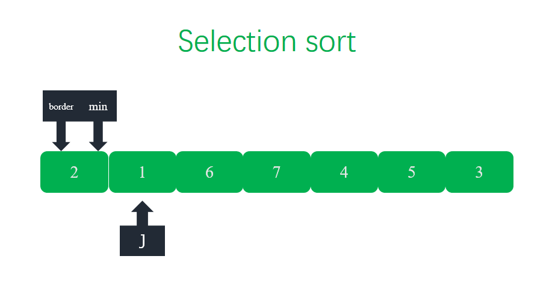
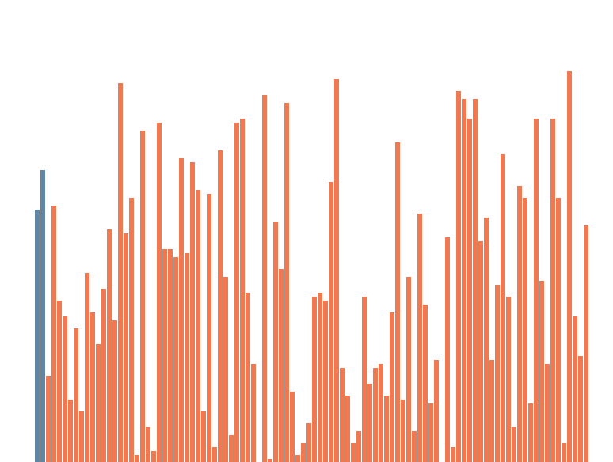
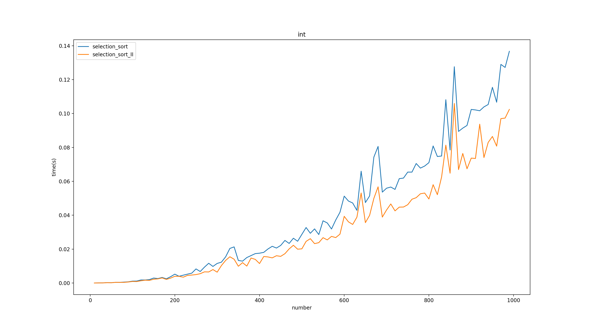
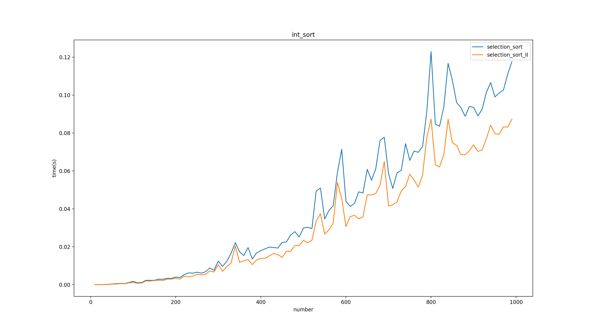
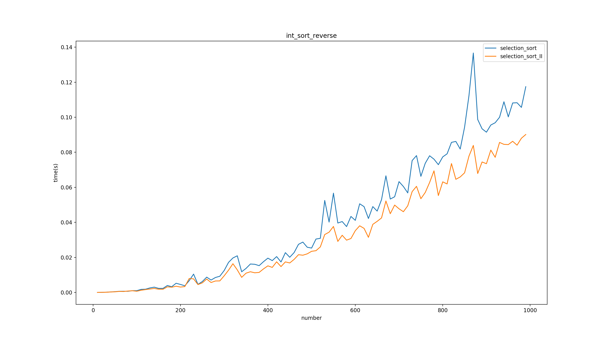
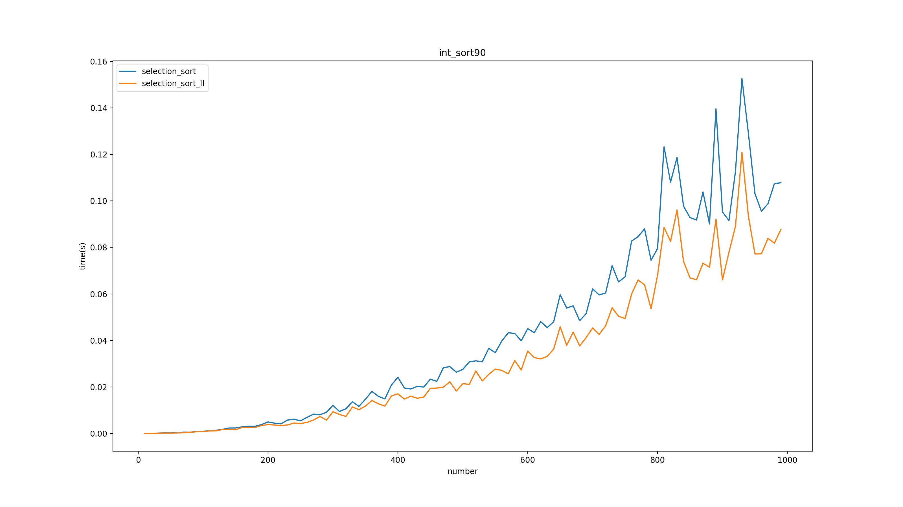
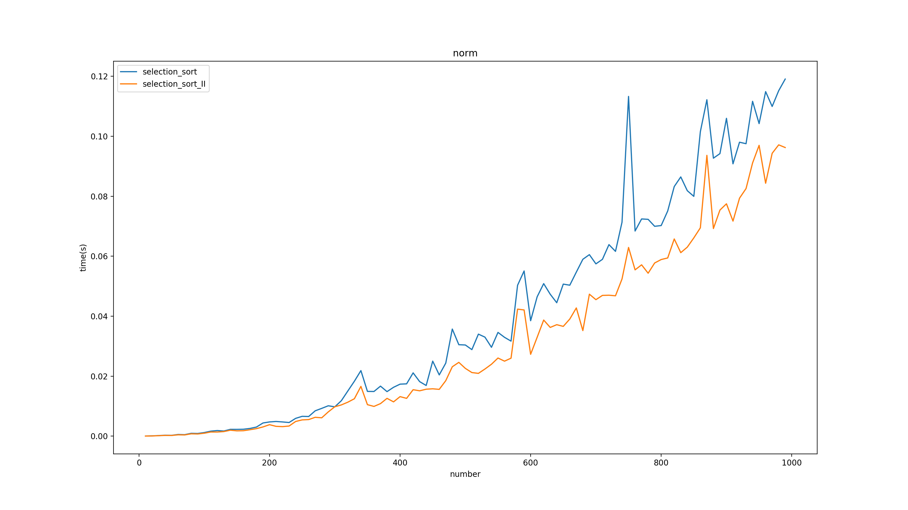
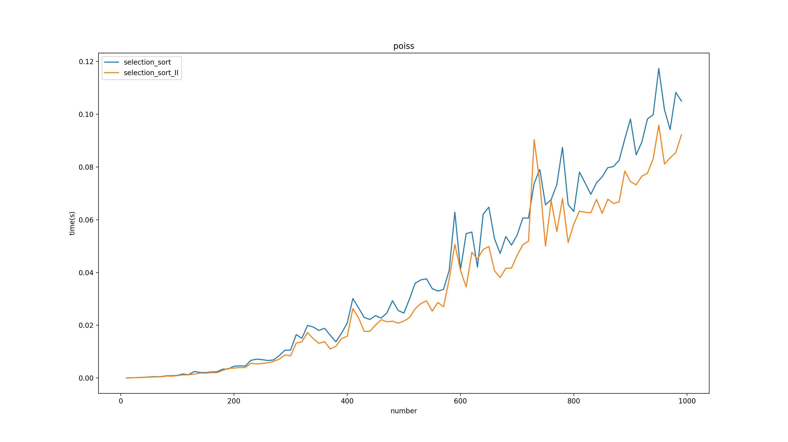
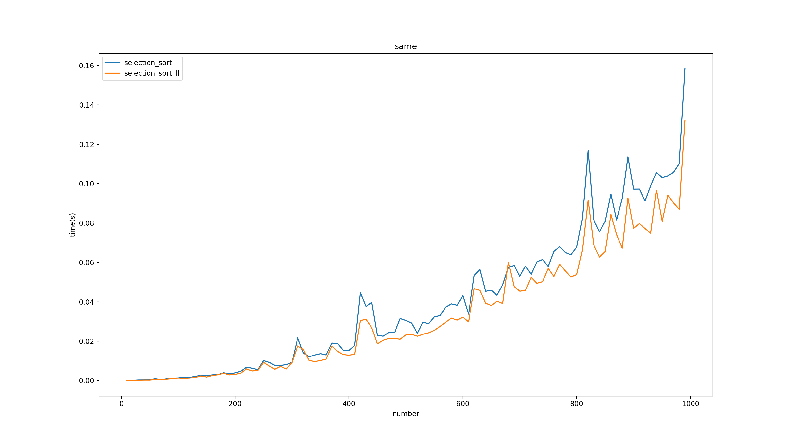
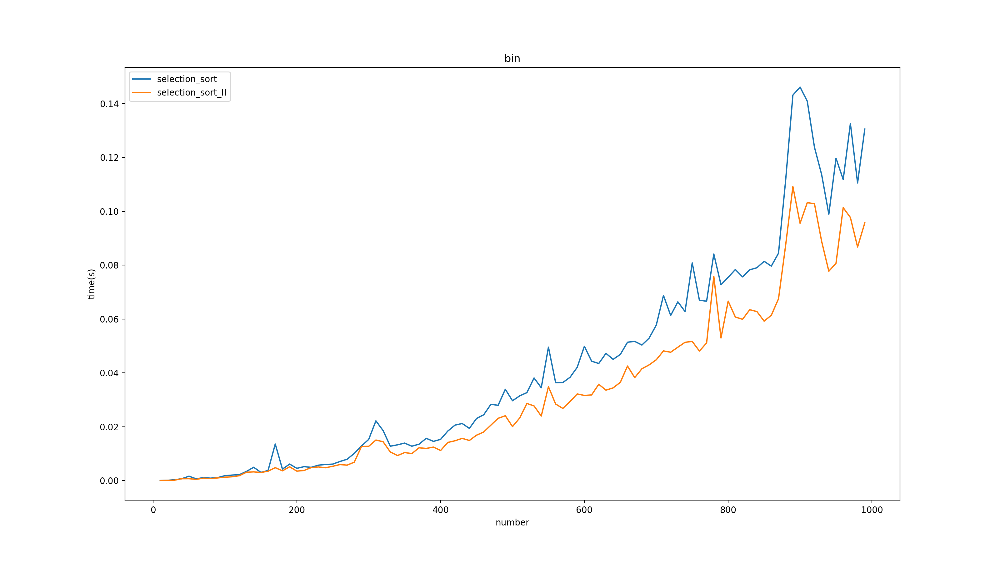

# 数据结构与算法之简单选择排序及其改进(可视化)
[toc]

## 1. 简单选择排序
### 1.1 简介
&emsp;&emsp;简单选择排序算法不断的搜索子数组，找到子数组中的最大值或者最小值放置到最终的位置上，不断遍历循环直到遍历结束。
&emsp;&emsp;算法的伪代码：
```
function selection_sort(list):
    for i from 0 to list.length - 1:
        min_index = i
        for j from i + 1 to list.length - 1:
            if l[mind_index] > l[j]:
                min_index = j
            
        swap(list[min_index], l[i])
```
### 1.2 流程


### 1.3 可视化


### 1.4 python实现
```python
def selection_sort(l, start, end):
    '''
    @brief  选择排序算法[start, end]
    @param  l   需要进行排序的list
    @param  start   开始位置
    @param  end 结束位置
    '''
    for i in range(start, end + 1):
        minindex = i
        for j in range(i + 1, end + 1):
            if l[minindex] > l[j]:
                minindex = j
            
        l[minindex], l[i] = l[i], l[minindex]
```
## 2. 选择排序改进
### 2.1 改进思路
&emsp;&emsp;在每次遍历时同时找到子数组的最大值和最小值。需要注意的一种情况，即最大值和最小值交换的位置存在交叉，这也是下面代码中多了几个if的原因。例如:min_index=1, left=0, max_index=1 right=4,min_index或者提前交换会导致max_index找不到元素，因此需要进行重定向。
### 2.2 python代码实现
```python
def selection_sort_II(l, start, end):
    '''
    @brief  选择排序算法[start, end]
    @param  l   需要进行排序的list
    @param  start   开始位置
    @param  end 结束位置
    @note   通过每次遍历寻找最大值和最小值减少遍历次数，即便时间复杂度并未改变
    '''
    left = start
    right = end
    while left < right:
        min_index = left
        max_index = right
        for j in range(left, right + 1):
            if l[min_index] > l[j]:
                min_index = j

            if l[max_index] < l[j]:
                max_index = j
                
        if max_index != right:
            l[max_index], l[right] = l[right], l[max_index]
            
        if min_index == right:      
            min_index = max_index
		
        if min_index != left:
            l[min_index], l[left] = l[left], l[min_index]
            
        left += 1
        right -= 1
```
## 3. 性能对比
&emsp;&emsp;注：下面的图是用我的笔记本测试的不是很稳定，之后有时间用服务器测试下。
|数据分布|性能对比|
|:-:|:-:|
|无序||
|有序||
|逆序||
|90%有序||
|高斯分布||
|泊松分布||
|所有元素相同||
|数组中只有两个值||

## 4. 总结
|算法|时间复杂度|空间复杂度|最坏比较次数|最佳比较次数|
:-:|:-:|:-:|:-:|:-:|
|简单选择排序|$O(n^2)$|$O(1)$|$\frac{n(n-1)}{2}$|$\frac{n(n-1)}{2}$|
|选择排序II|$O(n^2)$|$O(1)$|$\frac{n(n-1)}{2}$|$\frac{n(n-1)}{2}$|