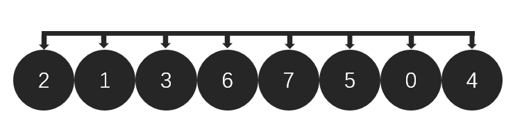
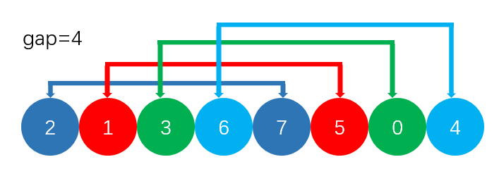
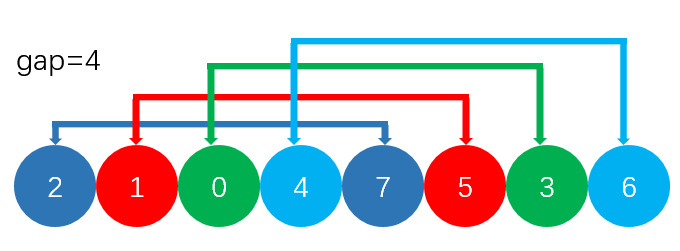
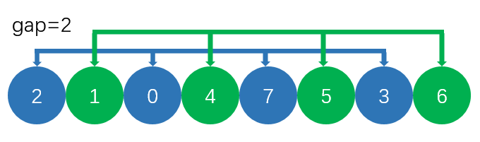
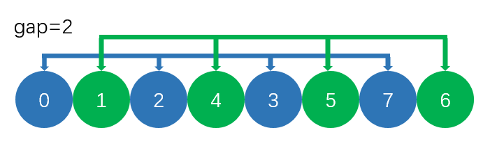
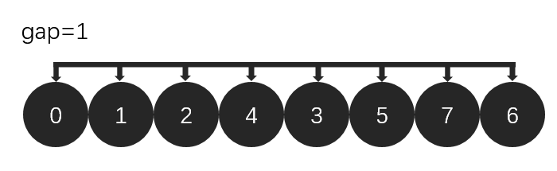
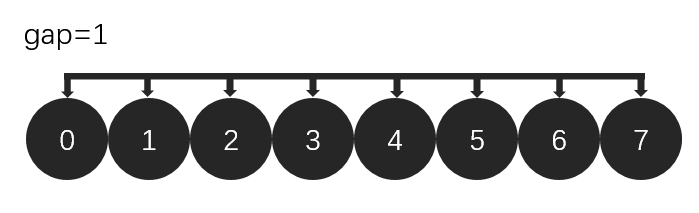
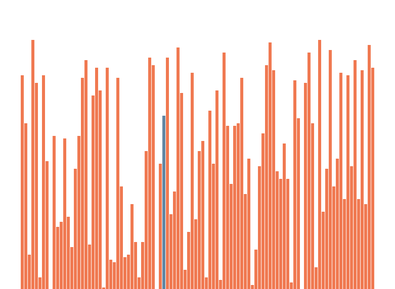

# 数据结构与算法之希尔排序及其改进（可视化）
[toc]

## 1 希尔排序
### 1.1 简介
&emsp;&emsp;希尔排序某种程度上是插入排序的一种改进版本。直接插入排序是通过不断将当前元素向前插入到指定位置实现排序的，插入排序中遍历的过程采用的gap是1，也就是每次索引元素的下标改变1。然而希尔排序（又称缩小增量排序）采用gap分组进行排序，可以理解为进行多次插入排序，只不过每一次的gap不同，一般为[n/2, n/4, ..., 1]。

### 1.2 流程
&emsp;&emsp;假如要排序下面数组：


&emsp;&emsp;插入排序一个一个的遍历数组将对应的值插入到前面的有序子数组中。
&emsp;&emsp;希尔排序如下图所示，采用的gap为[4,2,1]。
&emsp;&emsp;当gap=4时，如下图进行分组，对每一组进行插入排序：

&emsp;&emsp;下面是排序后的结果：

&emsp;&emsp;当gap=2时:

&emsp;&emsp;排序后:

&emsp;&emsp;当gap=1时，就回归到插入排序:

&emsp;&emsp;排序后:

### 1.3 可视化


### 1.4 python代码实现
```python
def shell_sort(l, start, end):
    '''
    @brief  希尔排序算法[start, end]
    @param  l   需要进行排序的list
    @param  start   开始位置
    @param  end 结束位置
    @param  hook_func   进行可视化的函数
    '''
    k = 1
    size = end - start + 1
    while int(size/3) > k:
        k = 3*k + 1
    
    while k >= 1:
        for i in range(start, end + 1):
            j = i
            while j >= k and l[j] < l[j - k]:
                l[j], l[j - k] = l[j - k], l[j]
                j -= k
        
        k = int(k/3)
```
## 2 改进II：使用不同的分组方式
## 3 改进III：引入插入排序的改进方式
