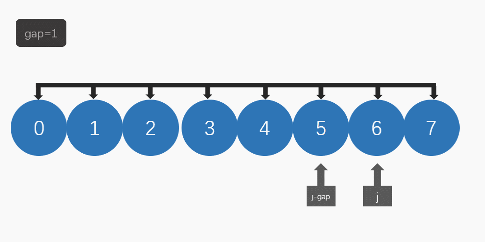

# 数据结构与算法之希尔排序及其改进（可视化）
[toc]

## 1 希尔排序
### 1.1 简介
&emsp;&emsp;希尔排序某种程度上是插入排序的一种改进版本。直接插入排序是通过不断将当前元素向前插入到指定位置实现排序的，插入排序中遍历的过程采用的gap是1，也就是每次索引元素的下标改变1。然而希尔排序（又称缩小增量排序）采用gap分组进行排序，可以理解为进行多次插入排序，只不过每一次的gap不同，一般为[n/2, n/4, ..., 1]。

### 1.2 流程
&emsp;&emsp;假如要排序下面数组：


&emsp;&emsp;插入排序一个一个的遍历数组将对应的值插入到前面的有序子数组中。
&emsp;&emsp;希尔排序如下图所示，采用的gap为[4,2,1]。
&emsp;&emsp;当gap=4时，如下图进行分组，对每一组进行插入排序：

&emsp;&emsp;下面是排序后的结果：

&emsp;&emsp;当gap=2时:

&emsp;&emsp;排序后:

&emsp;&emsp;当gap=1时，就回归到插入排序:

&emsp;&emsp;排序后:




### 1.3 可视化


### 1.4 python代码实现
```python
def shell_sort(l, start, end):
    '''
    @brief  希尔排序算法[start, end]
    @param  l   需要进行排序的list
    @param  start   开始位置
    @param  end 结束位置
    @param  hook_func   进行可视化的函数
    '''
    k = 1
    size = end - start + 1
    while int(size/3) > k:
        k = 3*k + 1
    
    while k >= 1:
        for i in range(start, end + 1):
            j = i
            while j >= k and l[j] < l[j - k]:
                l[j], l[j - k] = l[j - k], l[j]
                j -= k
        
        k = int(k/3)
```
## 2 改进II：使用不同的分组方式
### 2.1 思路
&emsp;&emsp;希尔排序使用不同的分组方式性能大大不同，因此一个优化方式是使用不同的分组方式进行希尔排序，下面使一些分组方式：
- $3k+1$:[1, 4, 7, 10, ...]
- $t^k$:[1, t, t^2, t^3, ...]
- $9*4^k-9*2^k+1$, [1, 19, ...]
- $9*4^k-9*2^k+1$,$4^k-3*2^k+1$综合:[1, 5, 19, 41, 109, 209, 505, 929, 2161, 3905, 8929]

### 2.2 python代码实现
&emsp;&emsp;为了方便进行测试，下面给定一个制定分组方式的shell排序代码。
&emsp;&emsp;下面的get_shell_steps是用来根据制定的gap生成函数和数组长度生成目标分组。
```python
def get_shell_steps(n, func, t=2):
    '''
    @brief  n   数组元素数量
    @param  func    生成分组间距的函数，接口只需要保持接受两个int，返回一个int即可比如：
                    def k3(k, t):
                        return 3 * k + 1
    @param  t   职位shell_step_geo_inc准备的t参数
    @return 返回shell排序的步进数组
    
    '''
    k_list = []
    i = 0
    while True:
        k =  int(func(i, t))
        if k >= n:
            return k_list
            
        k_list.append(k)
        i += 1
        
    return k_list
```
&emsp;&emsp;下面的代码是接受一个分组数组的希尔排序
```python
def shell_sort_custom(l, start, end, k_list):
    '''
    @brief  希尔排序算法使用用户自定义的步长, [start, end]
    @param  l   需要进行排序的list
    @param  start   开始位置
    @param  end 结束位置
    @param  k_list  步进
    '''
    k = len(k_list) - 1
    count = 0
    while k >= 0:
        for i in range(start, end + 1):
            j = i
            while j >= k_list[k] and l[j] < l[j - k_list[k]]:
                l[j - k_list[k]], l[j] = l[j], l[j - k_list[k]]
                j -= k_list[k]
        
        k -= 1
```
&emsp;&emsp;下面是一些分组生成函数的示例:
```python
def shell_step_normal(k, t=2):
    return int(3 * k + 1)
    
    
def shell_step_geo_inc(k, t=2):
    '''
    @breif  k_list为1, t, t^2, ..., t^n    
    '''
    return int(math.pow(t, k))

def shell_step_poly1(k, t):
    '''
    @brief  9*4^k-9*2^k+1
    '''
    return int(9 * math.pow(4, k) - 9 * math.pow(2, k) + 1)
    
def shell_step_poly12(k, t):
    '''
    @brief  将poly1和poly2结合起来，主要来自于algorithm4上
    '''
    k_list = [1, 5, 19, 41, 109, 209, 505, 929, 2161, 3905, 8929]   
    return int(k_list[k])
```
&emsp;&emsp;性能测试见下面的章节。
## 3 改进III：引入插入排序的改进方式
### 3.1 思路
&emsp;&emsp;既然希尔排序是插入排序的改进版本那么插入排序的改进策略便可以应用于希尔排序。
&emsp;&emsp;插入排序优化使用哨兵和二分查找法下面就给出两个版本的实现。
### 3.2 哨兵版本实现
```python
def shell_sort_custom_sent(l, start, end, k_list):
    '''
    @brief  希尔排序算法使用用户自定义的步长, [start, end],引入哨兵进行优化
    @param  l   需要进行排序的list
    @param  start   开始位置
    @param  end 结束位置
    @param  k_list  步进
    '''
    #k_list = [1, 5, 19, 41, 109, 209, 505, 929, 2161, 3905, 8929]   #9*4^k-9*2^k+1,4^k-3*2^k+1
    #k = 1
    #while int((end - start)/3) > k:
    #    k = 3*k + 1
    k = len(k_list) - 1
    while k >= 0:
        for i in range(start, end + 1):
            j = i
            sent = l[j]
            while j >= k_list[k] and sent < l[j - k_list[k]]:
                l[j] = l[j - k_list[k]]
                j -= k_list[k]
            
            l[j] = sent
            
        k -= 1
```
### 3.3 二分查找版本实现
```python
def shell_sort_custom_bin(l, start, end, k_list):
    '''
    @brief  希尔排序算法使用用户自定义的步长, [start, end],使用二分查找进行搜索
    @param  l   需要进行排序的list
    @param  start   开始位置
    @param  end 结束位置
    @param  k_list  步进
    '''
    #k_list = [1, 5, 19, 41, 109, 209, 505, 929, 2161, 3905, 8929]   #9*4^k-9*2^k+1,4^k-3*2^k+1
    #k = 1
    #while int((end - start)/3) > k:
    #    k = 3*k + 1
    k = len(k_list) - 1
    count = 0
    while k >= 0:
        for i in range(start, end + 1):
            j = i
            sent = l[j]
            right_count = 0                   #引入count是为了方便下面进行mid的计算
            left_count = 0                      #这里的right和left只是表明数组上两个点的位置关系
            #while i - left_count * k_list[k] >= start:    #寻找查找边界
            #    left_count += 1
            left_count = int((i - i % k_list[k])/k_list[k])
            
            #left_count -= 1 
            left = i - left_count * k_list[k]
            #二分查找
            while right_count <= left_count:
                mid_count = int(right_count + (left_count - right_count)/2 )
                mid = i - mid_count * k_list[k] 
                if l[mid] < sent:
                    left_count = mid_count - 1
                else:
                    right_count = mid_count + 1
                
            left = i - left_count * k_list[k]    
            while j > left:
                if hook_func is not None:
                    hook_func(l, i, j, count)
                    count += 1
                
                l[j] = l[j - k_list[k]]
                j -= k_list[k]
            
            l[left] = sent
            
        k -= 1
```
## 4 性能测试
### 4.1 不同分组性能测试
#### 4.1.1 针对$t^k$的性能测试
&emsp;&emsp;$t^k$因为t是可变的因此单独进行性能测试，这里的版本并未进行插入排序的优化手段只是更改了分组方式，其中t取值为2~10。途中shell_sort_geo后面的数字便是$t$的值。
|数据分布|性能对比|
|:-:|:-:|
|无序||
|有序||
|逆序||
|90%有序||
|高斯分布||
|泊松分布||
|所有元素相同||
|数组中只有两个值||

#### 4.1.2 不同分组性能测试
&emsp;&emsp;这里对不同的分组情况进行性能测试，不同标签对应的分组如下：
- $3k+1$:shell_sort_norm
- $t^2$:sehll_sort_geo
- $9*4^k-9*2^k+1$, shell_sort_poly1
- $9*4^k-9*2^k+1$,$4^k-3*2^k+1$综合:shell_sortpoly12
   
|数据分布|性能对比|
|:-:|:-:|
|无序||
|有序||
|逆序||
|90%有序||
|高斯分布||
|泊松分布||
|所有元素相同||
|数组中只有两个值||

#### 4.2 优化方法性能测试
&emsp;&emsp;采用$2^k$分组，下面的标签分别对应：
- shell_sort_geo:无优化
- shell_sort_sent:使用哨兵
- shell_sort_bin:使用二分查找

|数据分布|性能对比|
|:-:|:-:|
|无序||
|有序||
|逆序||
|90%有序||
|高斯分布||
|泊松分布||
|所有元素相同||
|数组中只有两个值||

## 5 算法复杂度
|算法|时间复杂度|空间复杂度|最坏比较次数|最佳比较次数|
:-:|:-:|:-:|:-:|:-:|
|希尔排序算法|$O(n^{1.7})-O(n^2)$|$O(1)$|$\frac{n(n-1)}{2}$|$n-1$|